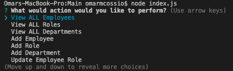
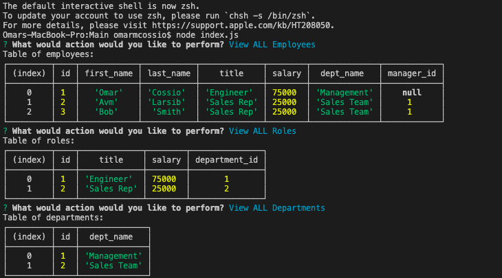
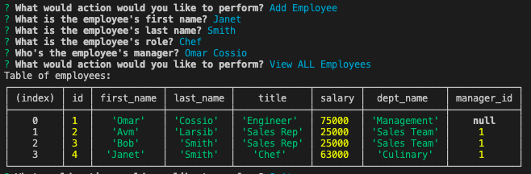

# Employee-Tracker

## Table of Contents
* [Description](#description)
* [Visuals](#visuals)
* [Demo](#demo)
* [Installation](#installation)
* [Usage](#usage)
* [Contributors](#contributors)
* [License](#license)
* [Roadmap](#roadmap)
* [Questions](#questions)

## Description
The Employee-Tracker is an application that helps the user keep track of their employees’ names, employee id, role, salary, and department. 

The application uses mySQL and JavaScript to combine different tables and allows the user to view employees and their information, add employees, and add roles. 

## Visuals
### Demo

### Landing promt with all options:

### Printed Tables:

### Sample user input:

ß
## Demo
[View Demo Here](https://drive.google.com/file/d/1c7-uodF9eeSMpshKfyOFmGoJ7IJkJHIX/view)

## Installation
* Cloning repo from Github
* npm install inquierer
* npm install mysql

## Usage
In terminal, type the command ‘npm start’ to start the application. Go through prompts to tell the program what it is the user wants to do. Follow the prompt. 

## Roadmap
Future development plans include: 
* Being able to update employee managers
* View employees by manager
* Delete departments, roles, and employees
* Viewing the total utilized budget of a department (combined salaries).

## Contributors
Omar Cossio

## License

Permission to use, copy, modify, and/or distribute this software for any purpose with or without fee is hereby granted, provided that the above copyright notice and this permission notice appear in all copies.

## Questions
* Click this link to see the code on [Github](https://github.com/omarcossio/employeeTracker).
* [Omar’s Email](mailto:omar119mce@gmail.com)
